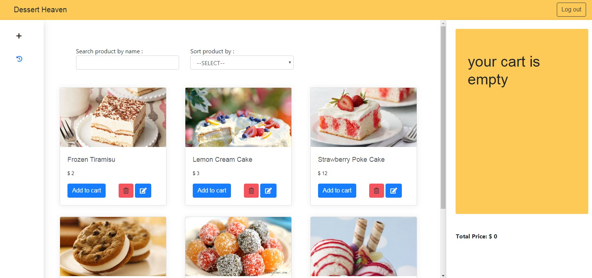
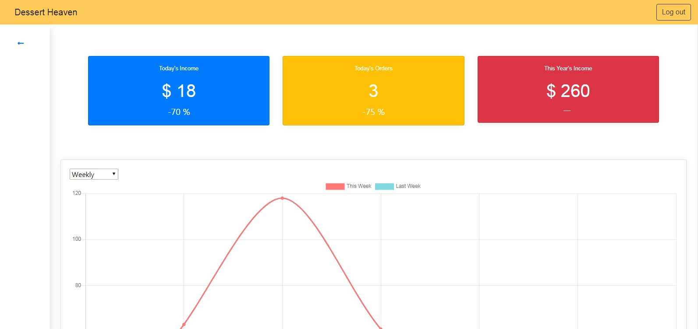

# Dessert Heaven App

Dessert heaven app is a website app for point of sales. The main use of this app is to take order from customer and to display our revenue.

## Requirement
- Node js
- React js
- Redux js

## How to use it?
Clone or download this repository, then open the directory in your terminal.
install all the dependencies by run the npm install.

```bash
$ git clone https://github.com/pandusudo/Dessert-heaven-app-with-redux.git
$ npm install
```

Your app is ready now! start the app by run npm start in the terminal

```bash
$ npm start
```

# Features
- Get All products
- Add product
- Reduce product
- Delete product
- Edit Product
- Login
- Register
- Chart Revenue
- Checkout History

## Screenshots



